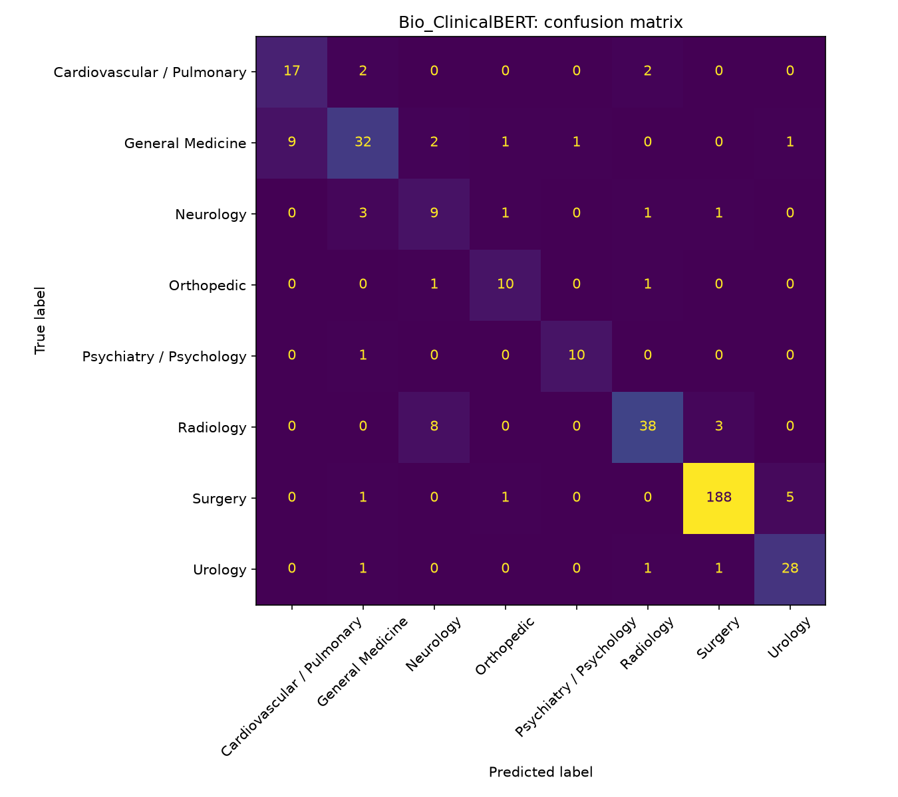

# Clinical Note Classification: Classical ML vs. BERT vs. LoRA-Tuned LLM

[](https://clinical-note-classifier.streamlit.app)

**[Try the live demo](https://clinical-note-classifier.streamlit.app)**: paste a clinical note and see the predicted specialty plus the words that drove the prediction.

> **Finding:** on this keyword-driven task, a simple TF-IDF + logistic regression baseline (0.820 macro-F1, under 1 minute on a CPU) outperformed both a fine-tuned Bio_ClinicalBERT (0.794, 22 minutes on a GPU) and a LoRA-tuned 0.5B-parameter LLM (0.783, 62 minutes, training 0.44% of its parameters). Bigger models were competitive but not better, at far higher cost.

## Problem
Much of the clinically important information in health records, such as symptoms, severity, and clinical reasoning, lives in free-text notes rather than structured fields, and reviewing notes manually does not scale. Automatically classifying notes is a building block for applications like cohort identification (phenotyping), clinical trial screening, and document routing. This project uses medical specialty classification on public transcription data as a testbed to compare three approaches: TF-IDF with logistic regression, a fine-tuned BERT-class model, and a LoRA-tuned LLM, asking whether larger models deliver enough improvement to justify their cost. The pipeline is designed to transfer to real EHR tasks, such as identifying depression from discharge summaries.

## Data
- **Source:** MTSamples medical transcriptions (public, via Kaggle). The dataset is not redistributed in this repository.
- **Task:** predict a note's medical specialty (8 most common specialties).
- **Cleaning:** removed missing and duplicate notes, very short notes, and labels that describe note types rather than specialties (e.g., "Discharge Summary", "SOAP / Chart / Progress Notes").
- **Size after cleaning:** 1,898 notes, 8 classes; stratified 80/20 train/test split (1,518 / 380).
- **Class imbalance:** Surgery makes up about half of the notes, so macro-F1 is the headline metric.

## Methods
1. **Baseline:** TF-IDF (unigrams + bigrams) + logistic regression with balanced class weights
2. **Encoder:** fine-tuned Bio_ClinicalBERT (BERT further pretrained on clinical notes); AdamW, lr 2e-5, 3 epochs, batch size 8, linear warmup schedule; same split as the baseline
3. **LLM:** Qwen2.5-0.5B fine-tuned with LoRA (rank 16 adapters on the attention projections; the 496M base weights stay frozen and only 2.2M parameters, 0.44%, are trained); lr 2e-4, 3 epochs, effective batch size 8, class-weighted loss, 512 tokens; same split as the baseline

## Results
| Model | Macro-F1 | Accuracy | Training time | Notes |
|---|---|---|---|---|
| TF-IDF + LR (balanced weights) | **0.820** | **0.890** | under 1 min | Best overall; reads the full note |
| Bio_ClinicalBERT, 256 tokens | 0.707 | 0.855 | 8 min (Apple M-series GPU) | No class weights; poor recall on small classes |
| Bio_ClinicalBERT, 256 tokens + class weights | 0.733 | 0.842 | 9 min | Recall up, precision down |
| Bio_ClinicalBERT, 512 tokens + class weights | 0.794 | 0.874 | 22 min | Best BERT; gap to baseline 0.026 |
| Qwen2.5-0.5B + LoRA, 512 tokens + class weights | 0.783 | 0.879 | 62 min (Apple M-series GPU) | Best on Orthopedic and Urology; weakest on Neurology and Psychiatry |




## LoRA experiment: fine-tuning an LLM on a laptop
- **Efficiency:** LoRA froze all 496M base weights and trained 2.2M adapter and classification-head parameters (0.44%), making fine-tuning a 0.5B-parameter LLM feasible in about an hour on a laptop GPU.
- **Result:** 0.783 macro-F1, close to the best BERT run (0.794) and below the baseline (0.820).
- **Mixed per-class picture:** the LLM was the strongest model on Orthopedic (F1 0.92) and Urology (0.92), but the weakest on Neurology (0.42) and Psychiatry (0.73, versus 0.95 for the baseline). With only 11 to 15 test notes in those classes, two or three notes move these scores substantially.
- **Caveat:** all models were compared on the same held-out test set without a separate validation set; a cross-validated comparison would be needed to call the differences significant.

**Overall takeaway:** model choice should follow the task. When labels are largely determined by distinctive vocabulary, TF-IDF captures the signal cheaply, transparently, and with the best accuracy, which is why the baseline powers the live demo. Contextual models are worth their cost when meaning depends on context, for example negation ("denies chest pain") or temporality.

## Error analysis (baseline)
- **Strongest classes:** Surgery (F1 0.97) and Psychiatry/Psychology (F1 0.95), both with distinctive vocabulary.
- **Weakest classes:** Neurology (F1 0.62) and Cardiovascular/Pulmonary (F1 0.63). These have few test examples (15 and 21), so their scores are also the least stable.
- **Urology:** precision 1.00 but recall 0.74. The model correctly identified 23 of 31 urology notes; the 8 missed notes were spread across Surgery (3), General Medicine (2), Neurology (2), and Radiology (1). Specialties overlap in real documentation (e.g., urologic procedures are also surgeries), which a single-label setup cannot capture.
- **Next step:** read the misclassified notes to identify patterns, and use cross-validation for more stable estimates on small classes.

## BERT experiments: what changed and why
Each experiment changed one setting at a time.

1. **First run (0.707):** BERT underperformed the baseline, mainly on small classes (macro recall 0.66; Neurology recall 0.33). Unlike the baseline, it had no class weighting, so the comparison was not fair: with Surgery at half the data, predicting large classes minimized loss.
2. **Adding class weights (0.733):** macro recall rose from 0.66 to 0.77 (Urology recall 0.52 to 0.90; Orthopedic 0.42 to 0.83), while macro precision fell from 0.82 to 0.71 and accuracy dropped slightly, a classic precision-recall trade-off.
3. **Reading 512 tokens instead of 256 (0.794):** every class improved. Truncation had been hiding specialty clues that appear later in notes, which TF-IDF could always see.

**Takeaways**
- Bigger models are not automatically better. Specialty labels are largely given away by distinctive terms ("cystoscopy", "echocardiogram"), which is exactly what TF-IDF captures; BERT's strength (context, negation) matters less here.
- The remaining 0.026 gap is small relative to the noise from minority classes with 11 to 21 test notes; cross-validation would be needed to claim either model is truly better.
- Cost matters: the baseline trains in under a minute on a CPU, while the best BERT needs ~22 minutes on a GPU and still truncates notes longer than 512 tokens.

## How to run
```bash
conda create -n clinical-nlp python=3.12 -y
conda activate clinical-nlp
pip install -r requirements.txt
pip install -e .
# download mtsamples.csv from Kaggle into data/
pytest
python -m clinical_nlp.data       # data pipeline
python -m clinical_nlp.baseline   # train + evaluate baseline
python -m clinical_nlp.bert --class-weights --max-len 512 --tag bert_cw_512   # best BERT run
python -m clinical_nlp.lora --class-weights --tag lora_qwen   # LoRA LLM run (~1 hour on Apple M-series)
streamlit run demo/streamlit_app.py   # live demo locally
```

## Live demo
The baseline model is deployed as a Streamlit app ([live demo](https://clinical-note-classifier.streamlit.app)) that shows the predicted specialty, top-3 probabilities, and the terms that drove each prediction. Code: `demo/streamlit_app.py`; the model is packaged by `src/clinical_nlp/export_model.py`.

## Limitations
- Transcribed sample notes, not real EHR notes; real-world performance would likely be lower.
- Single-label task even though specialties overlap.
- Small test sets for minority classes make their scores noisy.
- BERT and the LoRA run read at most 512 tokens, so longer notes are truncated.
- No separate validation set; comparisons use a single held-out test split.
- No patient identifiers, so a patient-level split is not possible here.
