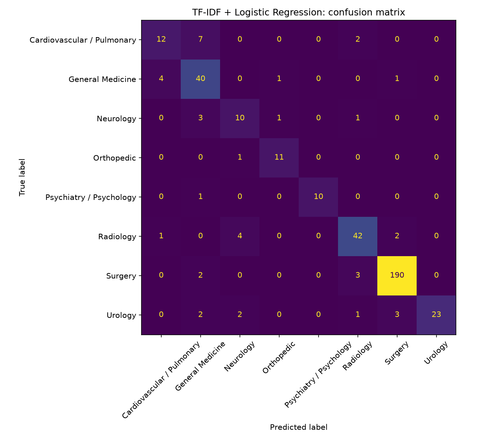

# Clinical Note Classification: Classical ML vs. BERT vs. LoRA-Tuned LLM

> TF-IDF + logistic regression baseline reaches 0.82 macro-F1 across 8 specialties. BERT and LoRA-tuned LLM comparisons are next.

## Problem
Much of the clinically important information in health records, such as symptoms, severity, and clinical reasoning, lives in free-text notes rather than structured EMR fields, and reviewing notes manually does not scale into production. Automatically classifying notes is a building block for real world applications like cohort identification (phenotyping), clinical trial screening, and document routing. This project uses medical specialty classification on public transcription data (e.g., Kaggle Dataset) to compare three approaches: (i) TF-IDF with logistic regression, (ii) a fine-tuned BERT-class model, and (iii) LoRA-tuned LLM, asking whether larger models deliver enough improvement to justify their cost. This pipeline can be designed to transfer to real RWE tasks, such as identifying depression from discharge summaries.

## Data
- Source: MTSamples medical transcriptions (public). Later version: MIMIC-IV notes (credentialed access; not redistributed here).
- Task: predict note specialty (top-N specialties).
- Size after cleaning:1,898 notes, 8 classes.

## Methods
1. Baseline: TF-IDF + logistic regression
2. Encoder: fine-tuned BERT-class model
3. LLM: LoRA fine-tune of a small open LLM

## Results
  | Model | Macro-F1 | Accuracy | Training time | Notes |
  |---|---|---|---|---|
  | TF-IDF + LR | 0.820 | 0.890 | under 1 min | Strong baseline; weakest on Neurology and Cardio/Pulm |
  | BERT-class | | | | in progress |
  | LoRA LLM | | | | in progress |

  

## Error analysis
What the best model gets wrong and why.

## How to run
```bash
python -m venv .venv && source .venv/bin/activate
pip install -r requirements.txt
pip install -e .   # makes the clinical_nlp package importable
pytest
python -m clinical_nlp.data       # data pipeline
python -m clinical_nlp.baseline   # train + evaluate baseline
```

## Serving
FastAPI endpoint + Docker (added later).

## Limitations
Dataset size, label noise, transcribed notes vs. real EHR, no patient-level split available.
